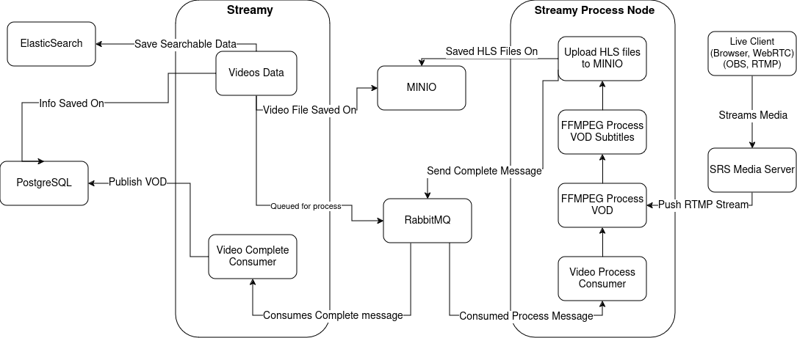

# Streamy

The Streamy Process Node is dedicated to handling long-running processes on separate servers, ensuring that these tasks are decoupled from user request handling. This architecture enhances performance and scalability by allowing any number of processing nodes to operate independently.

# How It Works



The Streamy project is responsible for handling user requests and managing various functionalities such as video creation, channels, comments, profiles, and more.

There is a different project, [Streamy Process Node](https://github.com/miadabdi/streamy_process_node) responsible for running long processes.

The [Streamy Process Node](https://github.com/miadabdi/streamy_process_node) takes on the responsibility of executing long-running processes. Here's how it works:

Video Uploads:

1. When a new video is uploaded, Streamy sends a message to the Process Node containing the video details.
2. The Process Node downloads the video from Minio.
3. It then processes and transcodes the video into HLS (HTTP Live Streaming) format.

Live Streaming:

1. When a new stream hits SRS (Simple Realtime Server), it is handed over to the Process Node.
2. The node transcodes the stream into HLS format as well using FFMPEG.

This separation of concerns ensures that user interactions remain responsive, while the heavy lifting of video processing is handled efficiently by dedicated nodes.

## Installation

There is a docker compose file in the project, to use it you must already have docker installed.

### Step 1: Configure Environment Variables

1. Rename `app.env.example` to `app.env` and `.env.example` to `.env`.
2. Fill out the .env and app.env files with the required environment variables. Descriptions for each variable are provided within the files.
   - .env is used by the Docker Compose file.
   - app.env is the primary environment file used by the application.

### Step 2: Start up dependencies

Run the Docker Compose file to start up the necessary dependencies:

```
sudo docker compose up -d
```

### Step 3: Install Packages and Run the Application

Install the necessary packages:

```bash
npm install
```

Start the application:

```bash
npm start
```

The application will be available on the port specified in the `app.env` file. You can route traffic to the app using Nginx.

## Details

This project supports video sharing (video on-demand) and live streaming functionalities.

Video on Demand

- Transcoding to HLS: Newly uploaded videos are transcoded to HLS (HTTP Live Streaming) format using [FFMPEG](https://www.ffmpeg.org/). This process involves:
  - Packaging videos and subtitles uploaded by users into HLS format.
  - Generating multiple versions of the same video, including different codecs, resolutions, and bitrates.

Live Streaming

- [SRS Media Server](https://github.com/ossrs/srs): Live streaming is managed by the SRS Media Server, which supports both RTMP and WebRTC streams.
  - SRS triggers a specified endpoint in our application for each new event, allowing our app to control and manage these events.

Channels and User Interaction

- Channels: Each user can create multiple channels, and each channel can host multiple videos and live streams.
- Comments: Only channels can post comments on videos.

## Contributing

Pull requests are welcome. For major changes, please open an issue first to discuss what you would like to change.

Please make sure to update tests as appropriate.

## License

[GNU General Public License v3.0](https://www.gnu.org/licenses/gpl-3.0.html)
